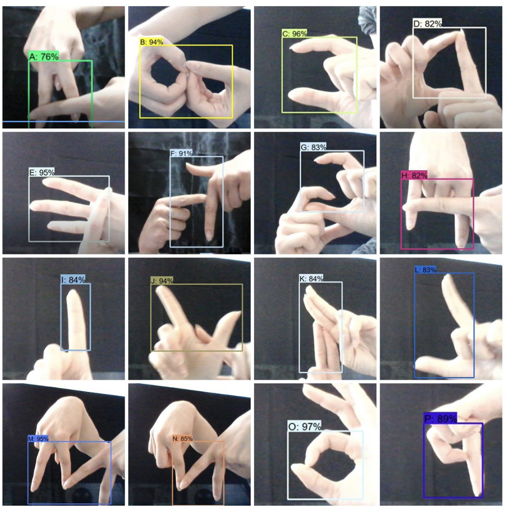

# detection-of-Turkish-alphabet-by-sign-language

**Figure 1.** A custom dataset for the Turkish Sign Language alphabet was developed

<!--  -->

**Figure 2.** Annotating the data using labelImg.py

<!-- img width="546" alt="Screenshot 2025-05-17 at 20 54 43" src="https://github.com/user-attachments/assets/bc16a6d0-5086-433b-a30f-643f80e7072b" /> -->

**Figure 3.** Detected letters and their highest confidence scores -1

<!--   -->
**Figure 4.** Detected letters and their highest confidence scores -2

<!--   -->
**Figure 5.** Detected letters and their highest confidence scores -3
