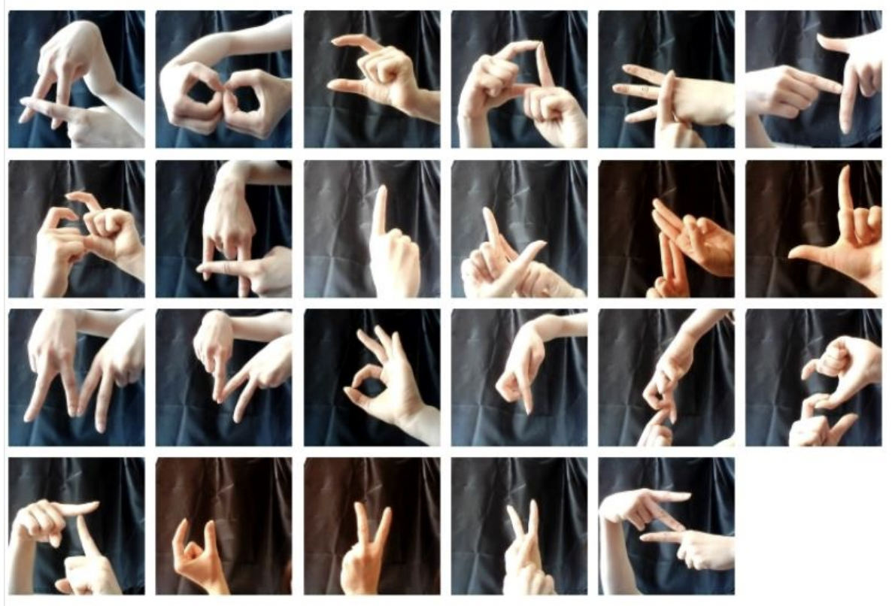

# Final Year BSc Computer Engineering Graduation Project

Real-Time Sign Language Detection Using Computer Vision

## Summary

This project focuses on developing a real-time system that recognizes sign language alphabet gestures using computer vision and deep learning techniques. The goal is to support communication for individuals with hearing impairments by enabling computers to interpret hand signs captured through a standard camera—without requiring any additional hardware.
## Background

Sign languages have long been vital for communication within deaf communities. Historical records trace the use of sign language back to the 5th century BC. For centuries, finger alphabets (manual representations of spoken language) served as the primary bridge between spoken and sign language.

Turkish Sign Language (TİD), though its origins are not precisely known, is believed to have roots in the Ottoman Empire, where deaf individuals lived and communicated within palace environments. Formal deaf education began during the reign of Abdulhamit II and evolved significantly during the early Republic of Turkey. While oralist methods dominated the early 20th century, modern Turkish schools have since embraced sign language-based education.

Sign languages are fully-fledged natural languages with their own grammar and vocabulary. They use visual-spatial modalities to convey meaning through hand gestures (manual) and facial expressions or body movements (non-manual). Despite regional differences, many sign languages share similar features, though they are not universal.

Sign language is used not only by the deaf and hard of hearing but also by hearing individuals—such as children of deaf adults (CODA), people with certain speech impairments, or those in close contact with the deaf community.

According to the 2013 edition of Ethnologue, there are 137 documented sign languages worldwide. Some have legal recognition; others do not.

## Objective

This project aims to:

- Build a system that detects and classifies hand gestures representing sign language letters using a live camera feed.

- Display the recognized letter on the screen in real time.

- Enable sign language recognition using only a standard webcam and computer, with no additional hardware required.
## Technologies & Tools

**Programming Language:** Python

**Development Environment:** Jupyter Notebook

**Libraries & Frameworks:** 
- OpenCV (for real-time image capture and processing),
- TensorFlow (for model training and prediction)

**Techniques:**
- Deep Learning
- Image Classification
- Data Preprocessing

  
## Dataset

The system was trained on a custom dataset created specifically for this project. The dataset contains labeled images of the Turkish Sign Language (TİD) alphabet, where each image represents a different hand gesture corresponding to a letter.

- The dataset was collected using a standard webcam.

- Each image was captured under various lighting conditions, black background and angles to improve model generalization.

*This dataset was entirely created by me as part of the graduation project.**

**Figure 1.** A custom dataset for the Turkish Sign Language alphabet was developed

## Methodology

**1.Literature Review & Tool Research:**
- Study core concepts in computer vision, deep learning, and sign language linguistics.

**2.Data Collection & Preprocessing:**
- Creat and preprocess gesture images (resize, normalize, augment), annotate.

<!--  -->

**Figure 2.** Annotating the data using labelImg.py

**3.Model Development:**
- Design and train a deep learning model to classify signs.

**4.Real-Time Integration:**
- Connect the model to a webcam using OpenCV to process live hand gestures.

<!--   -->
**Figure 4.** Detected letters and their highest confidence scores -2

<!--   -->
**Figure 5.** Detected letters and their highest confidence scores -3

**5.Testing & Evaluation:**
- Assess the system's performance on real-time input and improve accuracy

## Impact

This project provides an accessible, cost-free solution to bridge communication gaps for individuals with hearing disabilities. It lays the groundwork for future research in sign language recognition and could be extended to recognize full words or sentences in future iterations.
## Notes
*Note: The dataset is not publicly available.*

  
